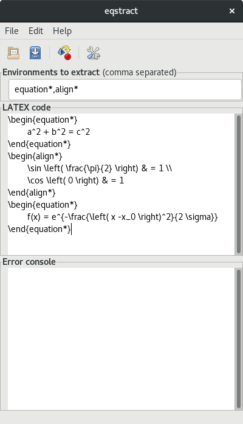
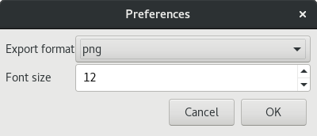
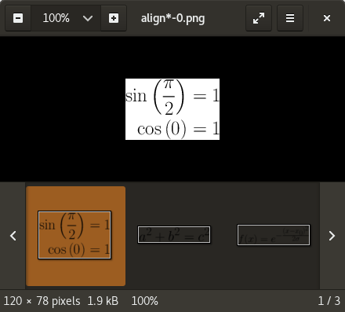

Eqstract
========

A graphical application for converting LaTeX equations into bitmap images. Currently
PNG and JPG are supported.

### Dependencies

* python2
* python2-PyPDF2
* pygtk2
* texlive
* texlive-aeguill
* texlive-preview
* texlive-pdfcrop

### Usage

To start the application, run `src/eqstract`. The user interface should be self explanatory.

* Enter the LaTeX environments to extract at the top (e.g. `equation*`)
* Put the LaTeX math code into the text area in the middle (e.q. `\begin{equation*}a^2+b^2=c^2\end{equation*}`)
* Hit the _extract_ button in the toolbar to generate the PNG or JPG images

Any errors during the process will be shown in the console at the bottom of the window. If
the console remains empty, the extraction was successful. The generated images can be found
in `src/out`.

Using the tool or menu bar, the current input can also be saved to a `.eqstract` file for
later reuse.

If needed, the LaTeX template can be tweaked in `src/prototype.tex`.

### Screenshots

